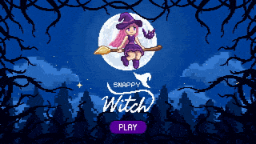
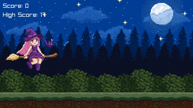

# Snappy Witch
A sidescroller based on good ol' Flappy Bird.

## How to Play
Click (or press the Space key) to jump. Do your best to avoid the obstacles.

It's designed to be hard so please don't break anything in frustration.

## Sprite Art
All art was designed by Carina Costa. [Follow her work on Behance!](https://www.behance.net/carinacosta10)

## Sound
Snappy Witch uses the following royalty-free audio:

[Dark Mysterious Halloween Night - Scary Creepy Spooky Horror Music](https://pixabay.com/music/fantasy-dreamy-childrens-dark-mysterious-halloween-night-scary-creepy-spooky-horror-music-116551/) by [SoundGalleryBy](https://pixabay.com/users/soundgalleryby-21339672/)

[Wood Smash 5](https://pixabay.com/sound-effects/wood-smash-5-170421/) by [Floraphonic](https://pixabay.com/users/floraphonic-38928062/)

[SFX_Jump_07](https://pixabay.com/sound-effects/sfx-jump-07-80241/) by [Pixabay](https://pixabay.com/users/pixabay-1/)

## Fonts
Snappy Witch uses the following royalty-free fonts:

[Fasthand](https://fonts.google.com/specimen/Fasthand) by [Danh Hong](https://fonts.google.com/?query=Danh+Hong)

[Pixelify Sans](https://fonts.google.com/specimen/Pixelify+Sans) by [Stefie Justprince](https://fonts.google.com/?query=Stefie+Justprince)
